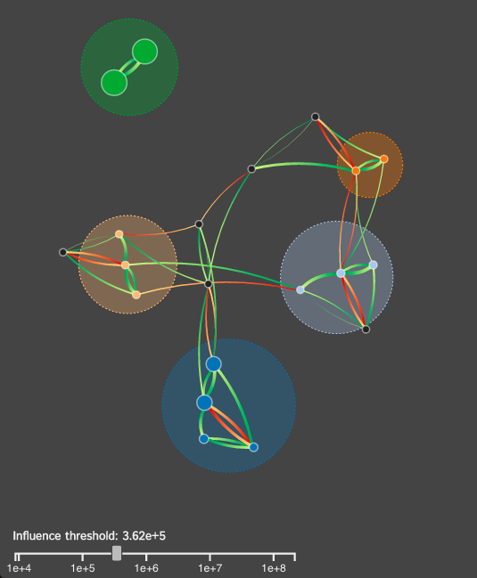
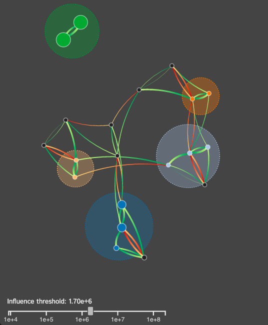
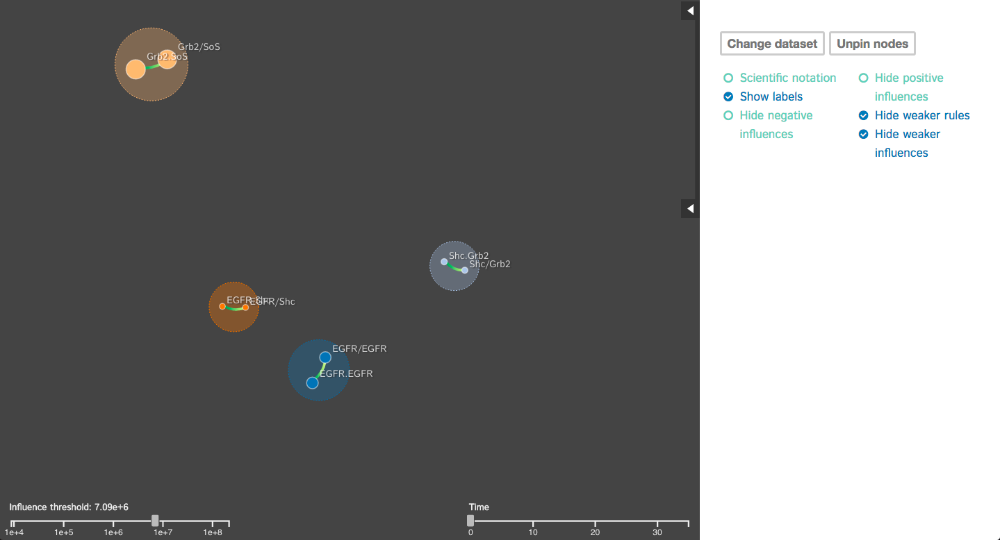
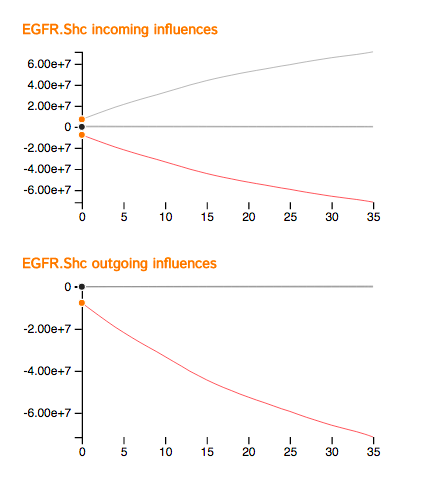

# CS424-Project3
Interactive visualization of dynamic rule networks 
Project Member: Andrew Burks, Kristine Lee, Xing Li

# Installation Instructions

- Extract Project 3's contents to a folder. 
- Navigate to the folder holding Project 3. Use the command:
```[path to python.exe]\python -m SimpleHTTPServer 8080``` to start the server. If this command cannot start the server, use the command: ```[path to python.exe]\python -m http.server 8080``` instead. 
- Go to localhost:8080 on Google Chrome to load the visualization.

Alternatively, the page is hosted using GitHub Pages at https://andrewtburks.github.io/CS424-Project3/

# How to Use

To load data, please use the provided "Change Dataset" button to load in individual json files or zipped time series json files. 

_Please make sure that the times series json files are in the format name_\__\[0-x]\.json (i.e flux_1.json, flux_2.json etc)_

# Motivation 

In biology, many times, the parts that make the biological system run are known. However, for many systems, the specifics regarding the interactions and effects within the system are unknown. Kappa Simulator ([Kasim](http://www.kappalanguage.org)) is a rule-based language and stochastic simulator. It is used, in this case, for simulating protein interaction networks. A tool to represent the results of these simulations can help the scientists better understand the stochastic biological systems they are modeling. If successful, this creates a feedback loop between the creation and the visualization of the simulations which iteratively improves both the system models as well as the visual analytics tools which aid in the understanding of the biological systems. The simulation results produced follow a standard format. However, a visual analytics tool is required to help analyze and understand these systems. The current tools do not scale well, are static, cluttered, and can not support time-series visualization.

# Summary

Our tool includes a force-directed network overlaid above influence-based clustering information for the Kappa rules (these influences are generated by the Kappa Simulator). Due to relatively small number of nodes in these protein interaction simulations along with the simple, single-parameter threshold clustering method, the threshold is interactively controllable, and the clustering will recompute in real-time. To reduce clutter, the user may choose to manually rearrange areas of the network, as well as hide nodes or edges which fall below the clustering threshold. Time series data based on a sliding time window can also be viewed assuming the proper json files have been loaded. 

There are also two supplemental visualizations with the time series data which show the influence of a selected node over time.

# Screen shots
- Clustering

    
    
- Hovering

    
- Button Toggles

    
- Supplemental Visualizations

    

# Demo

See a video of the tool in action [here](https://vimeo.com/195336381)

# Formal Write-Up

A formal write-up can be found [here](https://github.com/AndrewTBurks/CS424-Project3/blob/master/Writeup.pdf)
